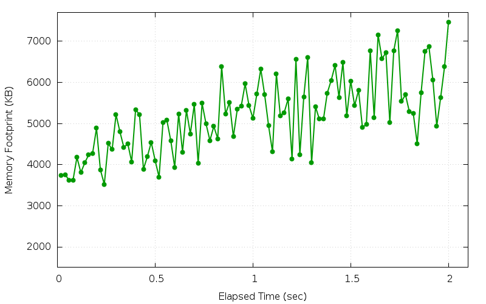
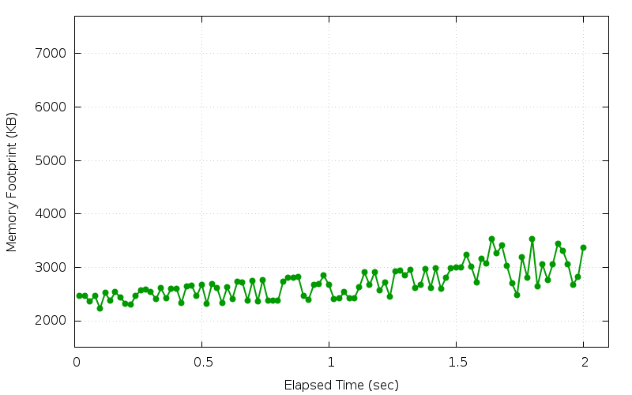

== Test Modes

One unique feature of `Test::Nginx` is that it allows running the same
test suite in wildly different ways, or test modes, by just configuring
some system environment variables. Different test modes have different
focuses and may find different categories of bugs or performance issues
in
the applications being tested. The data driven nature of the test framework
makes it easy to add new test modes without changing the user test files
at all. And it is also possible to combine different test modes to form
new (hybrid) test modes. The capability of running the same test suite
in many different ways helps squeezing more value out of the tests
we already have.

This section will iterate through various different test modes supported
by `Test::Nginx::Socket` and their corresponding system environment variables
used to enable or control them.

=== Benchmark Mode

`Test::Nginx` has built-in support for performance testing or benchmarking.
It can invoke external load testing tools like `ab` and `weighttp` to load
each test case as hard as possible.

To enable this benchmark testing mode, you can specify the `TEST_NGINX_BENCHMARK`
system environment variable before running the `prove` command. For example,

[source,bash]
----
export TEST_NGINX_BENCHMARK='2000 2'
prove t/foo.t
----

This will run all the test cases in `t/foo.t` in benchmark mode. In particular,
the first number, `2000` in the environment variable value indicates the
total number of requests used to flood the server while the second number,
`2`, means that the number of concurrent connections the client will use.

If the test case uses an HTTP 1.1 request (which is the default), then
the test scaffold
will invoke the `weighttp` tool. If it is an HTTP 1.0 request, then the
test scaffold invokes the `ab` tool.

This test mode requires the `unbuffer` command-line utility from the `expect`
package, as well as the `ab` and `weighttp` load testing tools. On Ubuntu/Debian
systems, we can install most of the dependencies with the command

[source,bash]
----
sudo apt-get install expect apache2-utils
----

You may need to build and install `weighttp` from source on Ubuntu/Debian
yourself due to the lack of the Debian package.

For the Mac OS X system, on the other hand, we can use `homebrew` to install
it like this:

[source,bash]
----
brew install expect weighttp
----

Now let's consider the following example.

.t/hello.t
[source,test-base]
----
use Test::Nginx::Socket 'no_plan';

run_tests();

__DATA__

=== TEST 1: hello world
--- config
    location = /hello {
        return 200 "hello world\n";
    }
--- request
    GET /hello
--- response_body
hello world
----

Then we run this test file in the benchmark mode, like this:

[source,bash]
----
export TEST_NGINX_BENCHMARK='200000 2'
prove t/hello.t
----

The output should look like this:

....
t/hello.t .. TEST 1: hello world
weighttp -c2 -k -n200000 http://127.0.0.1:1984/hello
weighttp - a lightweight and simple webserver benchmarking tool

starting benchmark...
spawning thread #1: 2 concurrent requests, 200000 total requests
progress:  10% done
progress:  20% done
progress:  30% done
progress:  40% done
progress:  50% done
progress:  60% done
progress:  70% done
progress:  80% done
progress:  90% done
progress: 100% done

finished in 2 sec, 652 millisec and 752 microsec, 75393 req/s, 12218 kbyte/s
requests: 200000 total, 200000 started, 200000 done, 200000 succeeded, 0 failed, 0 errored
status codes: 200000 2xx, 0 3xx, 0 4xx, 0 5xx
traffic: 33190005 bytes total, 30790005 bytes http, 2400000 bytes data
t/hello.t .. ok
All tests successful.
Files=1, Tests=2,  3 wallclock secs ( 0.01 usr  0.00 sys +  0.33 cusr  1.47 csys =  1.81 CPU)
Result: PASS
....

The most important line in this:

....
finished in 2 sec, 652 millisec and 752 microsec, 75393 req/s, 12218 kbyte/s
....

We can see that this test case can achieve 75393 requests per second and
12218 KB per second. Not bad for a single NGINX worker process!

It is also important to keep an eye on failed requests. We surely do not
care about the performance of error pages. We can get the number of error
responses by checking the following output lines:

....
requests: 200000 total, 200000 started, 200000 done, 200000 succeeded, 0 failed, 0 errored
status codes: 200000 2xx, 0 3xx, 0 4xx, 0 5xx
....

We are glad to see that all our requests succeeded in this run.

If we want to benchmark the performance of multiple NGINX worker processes
so as to utilize multiple CPU cores, then we can add the following lines
to the test file prologue, _before_ the line `run_tests()`:

[source,perl]
----
master_on();
workers(4);
----

This way we can have 4 NGINX worker processes sharing the load.

Behind the scenes, the test scaffold assembles the command line involving
`weighttp` from the test block specification, in this case, the command
line looks like this:

[source,bash]
----
weighttp -c2 -k -n200000 http://127.0.0.1:1984/hello
----

There exists complicated cases, however, where the test scaffold fails
to derive the exact command line equivalent.

We can also enforce HTTP 1.0 requests in our test block by appending the
"HTTP/1.0" string to the value of the `--- request` section:

....
--- request
    GET /hello HTTP/1.0
....

In this case, the test scaffold will invoke the `ab` tool to flood the
matching HTTP 1.0 request. The output might look like this:

....
t/hello.t .. TEST 1: hello world
ab -r -d -S -c2 -k -n200000 http://127.0.0.1:1984/hello
This is ApacheBench, Version 2.3 <$Revision: 1706008 $>
Copyright 1996 Adam Twiss, Zeus Technology Ltd, http://www.zeustech.net/
Licensed to The Apache Software Foundation, http://www.apache.org/

Benchmarking 127.0.0.1 (be patient)
Completed 20000 requests
Completed 40000 requests
Completed 60000 requests
Completed 80000 requests
Completed 100000 requests
Completed 120000 requests
Completed 140000 requests
Completed 160000 requests
Completed 180000 requests
Completed 200000 requests
Finished 200000 requests

Server Software:        openresty/1.9.15.1
Server Hostname:        127.0.0.1
Server Port:            1984

Document Path:          /hello
Document Length:        12 bytes

Concurrency Level:      2
Time taken for tests:   3.001 seconds
Complete requests:      200000
Failed requests:        0
Keep-Alive requests:    198000
Total transferred:      33190000 bytes
HTML transferred:       2400000 bytes
Requests per second:    66633.75 [#/sec] (mean)
Time per request:       0.030 [ms] (mean)
Time per request:       0.015 [ms] (mean, across all concurrent requests)
Transfer rate:          10798.70 [Kbytes/sec] received

Connection Times (ms)
              min   avg   max
Connect:        0     0    1
Processing:     0     0  132
Waiting:        0     0  132
Total:          0     0  132
t/hello.t .. ok
All tests successful.
Files=1, Tests=2,  4 wallclock secs ( 0.02 usr  0.00 sys +  0.51 cusr  1.39 csys =  1.92 CPU)
Result: PASS
....

The most important output lines, in this case, are

....
Failed requests:        0
Requests per second:    66633.75 [#/sec] (mean)
Transfer rate:          10798.70 [Kbytes/sec] received
....

Different hardware and operating systems may lead to very different results.
Therefore, it generally does not make sense at all to directly compare
numbers obtained from different machines and systems.

Clever users can write some external scripts to record and compare these
numbers across different runs, so as to keep track of performance changes
in the web server or application. Such comparison scripts must take into
account any measurement errors and any disturbances from other processes
running in the same system.

Performance benchmark is a large topic and we gives it a more detailed
treatment in a dedicated chapter.

=== HUP Reload Mode

By default, the test scaffold always starts a fresh instance of the NGINX
server right before running each individual test block and stops the server
right after
the checks of the current test block are all done. This ensures that there
is no side effects among test blocks, especially those running successively.
But
it can also be desired to ensure everything also works fine when the NGINX
server is just reloading its configurations without a full server restart.
Such configuration
reloading is usually done via sending the `HUP` signal to the master process
of NGINX. So we usually call it "HUP reload".

NOTE: On some non-UNIX-style operating systems like Microsoft Windows,
there is no such things as signals. In such platforms, NGINX users usually
use the `-s reload`
command-line option of the `nginx` executable to do the same thing. It
should be noted, however, the use of
the `-s reload` option has one side effect that can be annoying: it loads
the nginx configuration _twice_ instead of just once, which may incur unnecessary
initialization overhead. Therefore, we should always use the `HUP` signal
instead of `-s reload` whenever possible.

One example of OpenResty features that behaves different upon HUP reload
than server
restart is the shared dictionary mechanism (https://github.com/openresty/lua-nginx-module/#lua_shared_dict[lua_shared_dict])
that does not wipe out
any existing data in the shared memory storage during HUP reload. When
testing
this feature or application code relying on this feature, it is wise to
test how it behaves upon HUP reload. We saw in the past that some 3rd-party
NGINX C modules dealing with shared memory, for example, have bugs across
HUP reloads, like nasty memory leaks.

`Test::Nginx` has built-in support for the HUP reload test mode, which
can be enabled by specifying the `TEST_NGINX_USE_HUP=1` environment:

[source,bash]
----
export TEST_NGINX_USE_HUP=1
----

Then we can run our existing test suite as usual but now HUP signal is
used by the test scaffold to reload the NGINX configuration specified by
different test blocks.
The NGINX server will only be automatically shut down when the test harness
finishes running each test file.

NOTE: We can even avoid the automatic server shutdown behavior upon test
file completion by specifying the `TEST_NGINX_NO_CLEAN=1` environment.
See the later section
<<no-clean,Manual Debugging Mode>> for more details.

UNIX signals like `HUP` usually work asynchronously. Thus, there is a delay
between the test scaffold finishes sending the `HUP` signal to the NGINX
server and the NGINX server forks off a new worker process using the newly
loaded configuration and starts accepting new connections with the new
worker. For this reason, there is a (small) chance that the request of
a test block is served by an NGINX worker process still using the configuration
specified by the previous test block. Although `Test::Nginx` tries hard
to wait as long as it can with some simple heuristics, some test blocks
may still experience some intermittent test failures due to the mismatch
of the NGINX configuration. Be prepared for such false positives when using
the HUP reload testing mode.  This is also one of the reasons why the HUP
reload mode is not the default. We hope this issue can be further improved
in the future.

Another limitation with the HUP reload mode is that HUP reloads only happen
upon test block boundaries. There are cases where it is desired to issue
HUP reload in the middle of a test block. We can achieve that by using
some custom Lua code in your test block to send a `HUP` signal yourself,
as in

[source,lua]
----
local f = assert(io.open("t/servroot/logs/nginx.pid", "r"))
local master_pid = assert(f:read())
assert(f:close())
assert(os.execute("kill -HUP " .. master_pid) == 0)
----

=== Valgrind Mode

One of the biggest enemies in web servers or web applications that are
supposed
to run in a 24x7 manner is memory issues. Memory issues include memory
leaks, memory invalid reads (like reading beyond the buffer boundary),
and memory invalid writes (like buffer overflow). In case of memory leaks,
the processes can take up more and more memory in the system and eventually
exhaust all the physical memory available, leading to unresponsive systems
or triggering the system to start killing processes with force. Memory
invalid accesses, on the other hand, can lead to process crashes (like
segmentation faults), or worse, leading to nondeterminism in the process'
s behavior (like giving out wrong results).

http://valgrind.org/[Valgrind] is a powerful tool for programmers to detect
a wide range of memory
issues, including many memory leaks and many memory invalid accesses. This
is usually for debugging lower level code like the OpenResty core (including
the NGINX core), the Lua or LuaJIT VM, as well as those Lua libraries involved
with C and/or FFI. Plain Lua code without using FFI is considered "safe"
and is not subject to most of the memory issues.

NOTE: Plain Lua code without using FFI can still contain bugs that result
in memory leaks, like inserting new keys into a globally shared Lua table
without control or appending a string to a global Lua string infinitely.
Such memory leaks, however, cannot be detected by Valgrind since it is
managed by Lua or LuaJIT's garbage collector.

`Test::Nginx` provides a testing mode that can automatically use Valgrind
to run the existing tests and check if there is any memory issues that
can be caught by Valgrind. This test mode is called "Valgrind mode". To
enable this mode, just set the environment `TEST_NGINX_USE_VALGRIND`, as
in

[source,bash]
----
export TEST_NGINX_USE_VALGRIND=1
----

Then just run the test files as usual.

Let's consider the following example.

[source,test-base]
----
=== TEST 1: C strlen()
--- config
    location = /t {
        content_by_lua_block {
            local ffi = require "ffi"
            local C = ffi.C

            if not pcall(function () return C.strlen end) then
                ffi.cdef[[
                    size_t strlen(const char *s);
                ]]
            end

            local buf = ffi.new("char[3]", {48, 49, 0})
            local len = tonumber(C.strlen(buf))
            ngx.say("strlen: ", len)
        }
    }
--- request
    GET /t
--- response_body
strlen: 2
--- no_error_log
[error]
----

Here we use the `ffi.new` API to allocate a C string buffer of 3 bytes
long and initialize the buffer with the bytes 48, 49, and 0, in the decimal
ASCII code. Then we call the standard C function `strlen` via the `ffi.C`
API with our C string buffer.

It is worth noting that we need to first declare the `strlen` function
prototype via the `ffi.cdef` API. Since we declare the C function in the
request handler (`content_by_lua_block`), we should only declare it once
instead of upon every request. To achieve that, we use a Lua `if` statement
to check if the symbol `strlen` is already declared (when `strlen` is not
declared or defined, the Lua expression `C.strlen` would throw out a Lua
exception, which can make the `pcall` call fail).

This example contains no memory issues since we properly initialize our
C string buffer by setting the null terminator character (`\0`) at end
of our C string. The C function `strlen` should correctly report back the
length of the string, which is `2`, without reading beyond our buffer boundary.
Now we run this test file with the Valgrind mode enabled using the default
OpenResty installation's `nginx`:

[source,bash]
----
export TEST_NGINX_USE_VALGRIND=1
export PATH=/usr/local/openresty/nginx/sbin:$PATH

prove t/a.t
----

There should be a lot of output. The first few lines should look like this:

....
t/a.t .. TEST 1: C strlen()
==7366== Invalid read of size 4
==7366==    at 0x546AE31: str_fastcmp (lj_str.c:57)
==7366==    by 0x546AE31: lj_str_new (lj_str.c:166)
==7366==    by 0x547903C: lua_setfield (lj_api.c:903)
==7366==    by 0x4CAD18: ngx_http_lua_cache_store_code (ngx_http_lua_cache.c:119)
==7366==    by 0x4CAB25: ngx_http_lua_cache_loadbuffer (ngx_http_lua_cache.c:187)
==7366==    by 0x4CB61A: ngx_http_lua_content_handler_inline (ngx_http_lua_contentby.c:300)
....

Ouch! Valgrind reports a memory invalid read error. Fortunately it is just
a false positive due to the optimization inside the LuaJIT VM when it is
trying to create a new Lua string. The LuaJIT code repository maintains
a file named https://github.com/LuaJIT/LuaJIT/blob/master/src/lj.supp[lj.supp]
that lists all the known Valgrind false positives
that can be used to suppress these messages. We can simply copy that file
over and rename it to `valgrind.suppress` in the current working directory.
Then `Test::Nginx` will automatically feed this `valgrind.suppress` file
into Valgrind while running the tests in Valgrind mode. Let's try that:

[source,bash]
----
cp -i /path/to/luajit-2.0/src/lj.supp ./valgrind.suppress
prove t/a.t
----

This time, the test scaffold is calmed:

....
t/a.t .. TEST 1: C strlen()
t/a.t .. ok
All tests successful.
Files=1, Tests=3,  2 wallclock secs ( 0.01 usr  0.00 sys +  1.51 cusr  0.06 csys =  1.58 CPU)
Result: PASS
....

We might encounter other Valgrind false positives like some of those in
the NGINX core or the OpenSSL library. We can add those to the `valgrind.suppress`
file as needed. The `Test::Nginx` test scaffold always outputs suppression
rules that can be added directly to the suppression file. For the example
above, the last few lines of the output are like below.

....
{
   <insert_a_suppression_name_here>
   Memcheck:Addr4
   fun:str_fastcmp
   fun:lj_str_new
   fun:lua_setfield
   fun:ngx_http_lua_cache_store_code
   fun:ngx_http_lua_cache_loadbuffer
   fun:ngx_http_lua_content_handler_inline
   fun:ngx_http_core_content_phase
   fun:ngx_http_core_run_phases
   fun:ngx_http_process_request
   fun:ngx_http_process_request_line
   fun:ngx_epoll_process_events
   fun:ngx_process_events_and_timers
   fun:ngx_single_process_cycle
   fun:main
}
t/a.t .. ok
All tests successful.
Files=1, Tests=3,  2 wallclock secs ( 0.01 usr  0.00 sys +  1.47 cusr  0.07 csys =  1.55 CPU)
Result: PASS
....

The suppression rule generated is the stuff between the curly braces (including
the curly braces themselves):

....
{
   <insert_a_suppression_name_here>
   Memcheck:Addr4
   fun:str_fastcmp
   fun:lj_str_new
   fun:lua_setfield
   fun:ngx_http_lua_cache_store_code
   fun:ngx_http_lua_cache_loadbuffer
   fun:ngx_http_lua_content_handler_inline
   fun:ngx_http_core_content_phase
   fun:ngx_http_core_run_phases
   fun:ngx_http_process_request
   fun:ngx_http_process_request_line
   fun:ngx_epoll_process_events
   fun:ngx_process_events_and_timers
   fun:ngx_single_process_cycle
   fun:main
}
....

We could have simply copied and pasted this rule into the `valgrind.suppress`
file. It is worth mentioning however, we can make this rule more general
to exclude the C function frames belonging to the NGINX core and the ngx_lua
module (near the bottom of the rule) since this false positive is related
to LuaJIT only.

Let's continue our experiment with our current example. Now we edit our
test case and change the following line

[source,lua]
----
local buf = ffi.new("char[3]", {48, 49, 0})
----

to

[source,lua]
----
local buf = ffi.new("char[3]", {48, 49, 50})
----

That is, we replace the null character (with ASCII code 0) to a non-null
character whose ASCII code is 50. This change makes our C string buffer
lacks any null terminators and thus calling `strlen` on it will result
in memory reads beyond our buffer boundary.

Unfortunately running this edited test file fail to yield any Valgrind
error reports regarding this memory issue:

....
t/a.t .. TEST 1: C strlen()
t/a.t .. 1/?
#   Failed test 'TEST 1: C strlen() - response_body - response is expected (repeated req 0, req 0)'
#   at /home/agentzh/git/lua-nginx-module/../test-nginx/lib/Test/Nginx/Socket.pm line 1346.
#          got: "strlen: 4\x{0a}"
#       length: 10
#     expected: "strlen: 2\x{0a}"
#       length: 10
#     strings begin to differ at char 9 (line 1 column 9)
# Looks like you failed 1 test of 3.
....

The response body check fails as expected. This time `strlen` returns 4,
which is larger than our buffer size, 3. This is a clear indication of
memory buffer over-read. So why does Valgrind fail to catch this?

To answer this question, we need some knowledge about how LuaJIT allocates
memory. By default, LuaJIT uses its own memory allocator atop the system
allocator (usually provided by the standard C library). For performance
reasons, LuaJIT pre-allocates large memory blocks than request. Because
Valgrind has no knowledge about LuaJIT's own allocator and Lua user-level
buffer boundary definitions, it can be cheated and can get confused.

To remove this limitation, we can enforce LuaJIT to use the system allocator
instead of its own. To achieve this, we need build LuaJIT with special
compilation options like below.

[source,bash]
----
make CCDEBUG=-g XCFLAGS='-DLUAJIT_USE_VALGRIND -DLUAJIT_USE_SYSMALLOC'
----

The most important option is `-DLUAJIT_USE_SYSMALLOC` which forces LuaJIT
to use the system allocator. The other options are important for our debugging
as well, for example, the `CCDEBUG=-g` option is to enable debug symbols
in the LuaJIT binary while `-DLUAJIT_USE_VALGRIND` enables some other special
collaborations with Valgrind inside the LuaJIT VM.

If we are using the OpenResty bundle, we can simply build another special
version of OpenResty like below:

....
./configure \
    --prefix=/opt/openresty-valgrind \
    --with-luajit-xcflags='-DLUAJIT_USE_VALGRIND -DLUAJIT_USE_SYSMALLOC' \
    --with-debug \
    -j4
make -j4
sudo make install
....

This will build and install a special debug version of OpenResty for Valgrind
checks to the file system location `/opt/openresty-valgrind`.

NOTE: There is some other LuaJIT special build options that can further
help us, like `-DLUA_USE_APICHECK` and `-DLUA_USE_ASSERT`. But they are
beyond the scope of our current example.

Now let's try running our previous buggy example with this special OpenResty
and Valgrind:

[source,bash]
----
export TEST_NGINX_USE_VALGRIND=1
export PATH=/opt/openresty-valgrind/nginx/sbin:$PATH

prove t/a.t
----

This time Valgrind succeeds in catching the memory bug!

....
t/a.t .. TEST 1: C strlen()
==8128== Invalid read of size 1
==8128==    at 0x4C2BC34: strlen (in /usr/lib64/valgrind/vgpreload_memcheck-amd64-linux.so)
==8128==    by 0x5467217: lj_vm_ffi_call (in /opt/luajit21sysm/lib/libluajit-5.1.so.2.1.0)
==8128==    by 0x54B5DE7: lj_ccall_func (lj_ccall.c:1136)
==8128==    by 0x54CAD45: lj_cf_ffi_meta___call (lib_ffi.c:230)
==8128==    by 0x5465147: lj_BC_FUNCC (in /opt/luajit21sysm/lib/libluajit-5.1.so.2.1.0)
==8128==    by 0x4C72BC: ngx_http_lua_run_thread (ngx_http_lua_util.c:1015)
==8128==    by 0x4CB039: ngx_http_lua_content_by_chunk (ngx_http_lua_contentby.c:120)
...
....

We omit the rest of the output for brevity. Here Valgrind reports an invalid
read of one byte of memory in the C function `strlen`, which is exactly
what we'd expect. Mission accomplished!

NOTE: LuaJIT built with the system allocator should only be used with Valgrind
only. On computer architectures like x86_64, such LuaJIT may not even start
up.

From this example, we can see how application-level memory allocation optimizations
and management can compromise the effectiveness of Valgrind's memory issue
detection. Similarly, the NGINX core also comes with its own memory allocator
via "memory pools". Such memory pools tend to allocate page-sized memory
blocks for small allocations and thus can also inversely affect Valgrind'
s detection. OpenResty provides a https://github.com/openresty/no-pool-nginx[patch]
for the NGINX core to disable the memory pool optimizations altogether.
The easiest way to use the patch is to specify the `--with-no-pool-patch`
option when running the `./configure` script while building OpenResty.

NOTE: Since NGINX 1.9.13, NGINX provides a C macro `NGX_DEBUG_PALLOC` which
when set can be used to achieve similar effect as OpenResty's "no-pool
patch". But still the "no-pool patch" is much more aggressive and thorough
and can help find more potential memory problems in NGINX related C code.

This Valgrind mode is used by OpenResty developers on a daily basis and
has helped locate countless memory manage bugs in the OpenResty C and Lua/FFI
code base. Interestingly, this test mode also located memory issues in
the official NGINX core and the official LuaJIT core. Unlike analyzing
core dumps, Valgrind can almost always find the first scene of memory offends,
studying the memory error reports can usually give rise to immediate code
fixes.

As with all the other tools, Valgrind has its own limitations and cannot
find all the memory issues even when we carefully disable application level
memory allocators as demonstrated above. For example,

1. memory issues on
the C runtime stack cannot be caught by Valgrind (at least for Valgrind'
s default memcheck tool).
2. Also, memory leaks in application-level resource
managers cannot be detected. For example, memory leaks in NGINX's global
memory pool won't get detected since NGINX always destroy all the memory
pools upon process termination. Similarly, an ever growing Lua object managed
by the Lua garbage collector (GC) won't get caught either, since the Lua
VM always frees all its GC-managed objects.

Understanding the weakness of the tool is as important as understanding
its strengths. We shall see an alternative approach in the next section
for detecting leaks in the application-level memory managers.

NOTE: Google's https://github.com/google/sanitizers/wiki/AddressSanitizer[AddressSanitizer]
tool can also be used to detect memory
issues. As compared to Valgrind, it has the advantages of running much
faster
and can detect memory issues on the C runtime stack as well. Unfortunately
it has its own limitations too. For example, it requires special C/C++
compiler options to rebuild all the related C code and C libraries for
the best result. Also, it cannot find problems in dynamically generated
machine code (like from a Just-in-Time compiler) or hand-written
assembly code (like LuaJIT's Lua interpreter). Therefore, OpenResty developers
use Valgrind much more often.

=== Naive Memory Leak Check Mode

As we have seen from the previous section, Valgrind is great at detecting
a wide range of memory leaks and memory invalid accesses. But Valgrind
also suffers from limitations in detecting leaks in application-level memory
managers such as garbage collectors (GC) and memory pools, which is also
quite common in reality. To see this, let's consider the following simple
example that leaks in LuaJIT's GC-managed memory.

[source,test-base]
----
=== TEST 1:
--- config
    location = /t {
        content_by_lua_block {
            package.path = "/path/to/some/lib/?.lua;" .. package.path
            ngx.say("ok")
        }
    }
--- request
    GET /t
--- response_body
ok
--- no_error_log
[error]
----

This example demonstrates a common mistake made by many OpenResty beginners.
The `package.path` field specifies the search paths used by the `require`
builtin function for loading pure Lua modules. This string value is hooked
up in the global Lua table `package` which has the same lifetime as the
current Lua virtual machine (VM) instance. Since Lua VM instances usually
have the same lifetime as NGINX worker processes (unless the `lua_code_cache`
directive is turned off in `nginx.conf`), prepending a new string to the
value of `package.path` in a request handler like `content_by_lua_block`
apparently results in a memory leak.

Unfortunately Valgrind cannot find this leak at all since the leak happens
in the GC-managed memory inside the Lua VM because all such leaked memory
will always get released upon GC destruction (or VM destruction) before
the
current process exits, which fools Valgrind to think that there is no leaks
at all. Interested readers can try running this example with the "Valgrind
test mode" as explained in the previous section.

To address this limitation of Valgrind, `Test::Nginx::Socket` introduces
a new test mode called "naive memory leak check mode", or just "check leak
mode" for short. In this mode, the test scaffold performs the following
things:

1. loads the NGINX server with many of the test request specified in the
test block, in a way similar to the "benchmark test mode" we discussed
earlier,
2. and at the same time, periodically polls and records the memory footprint
of the NGINX worker process with the system command `ps`,
3. and finally analyzes the memory usage data points collected in 2) by
finds the slope (`k`) of a line that best fits those data points.

To make use of this mode, just specify the `TEST_NGINX_CHECK_LEAK=1` environment,
before running existing test files, as in

[source,bash]
----
export TEST_NGINX_CHECK_LEAK=1
prove t/a.t
----

Assuming the `t/a.t` test file contains the test block example given above,
we should get an output similar to the following.

....
t/a.t .. TEST 1:
LeakTest: [3740 3756 3620 3624 4180 3808 4044 4240 4272 4888 3876 3520 4516
 4368 5216 4796 4420 4508 4068 5336 5220 3888 4196 4544 4100 3696 5028 5080
 4580 3936 5236 4308 5320 4748 5464 4032 5492 4996 4588 4932 4632 6388 5228
 5516 4680 5348 5420 5964 5436 5128 5720 6324 5700 4948 4312 6208 5192 5268
 5600 4144 6556 4248 5648 6612 4044 5408 5120 5120 5740 6048 6412 5636 6488
 5184 6036 5436 5808 4904 4980 6772 5148 7160 6576 6724 5024 6768 7264 5540
 5700 5284 5244 4512 5752 6752 6868 6064 4940 5636 6388 7468]
LeakTest: k=22.6
t/e.t .. ok
All tests successful.
Files=1, Tests=3,  6 wallclock secs ( 0.01 usr  0.01 sys +  0.61 cusr  1.68 csys =  2.31 CPU)
Result: PASS
....

The special output lines from this test mode have the prefix `LeakTest:`.
The first such line lists all the data points for the memory footprint
size in the unit of kilo bytes (KB), collected every 0.02 seconds. And
the second line is the slope (`k`) of the data line that best fits these
data points. And in this case, `k` equals to `22.6`.

The slope of the line can usually serve as an indication for the speed
of memory leaking. The larger the slope is, the faster the leak is. A 2-digit
data line slope here is very likely an indication of memory
leak. To be sure, we plot these data points in a graph using the `gnuplot`
tool.

There are quite some fluctuations in the graph. This is due to how  garbage
collector normally behaves. It usually allocates page-sized or even larger
memory blocks than actually requested for performance reasons and delays
the release of unused memory blocks because of the sweep phase or something
else. Still, it is clear that the memory usage is going up over all.

We can try enforcing a full garbage collection cycle upon the entry of
our request handler, like this:

[source,nginx]
----
content_by_lua_block {
    collectgarbage()
    package.path = "/path/to/some/lib/?.lua;" .. package.path
    ngx.say("ok")
}
----

This way we can ensure that there is _no_ memory garbage hanging around
after the point we call the Lua builtin function `collectgarbage()`.

Now the output looks like this:

....
t/e.t .. TEST 1:
LeakTest: [2464 2464 2360 2464 2232 2520 2380 2536 2440 2320 2300 2464
 2576 2584 2540 2408 2608 2420 2596 2596 2332 2648 2660 2460 2680 2320
 2688 2616 2332 2628 2408 2728 2716 2380 2752 2360 2768 2376 2372 2376
 2732 2800 2808 2816 2464 2396 2668 2688 2848 2672 2412 2416 2536 2420
 2424 2632 2904 2668 2912 2564 2724 2448 2932 2944 2856 2960 2616 2672
 2976 2620 2984 2600 2808 2980 3004 2996 3236 3012 2724 3168 3072 3536
 3260 3412 3028 2700 2480 3188 2808 3536 2640 3056 2764 3052 3440 3308
 3064 2680 2828 3372]
LeakTest: k=7.4
t/e.t .. ok
All tests successful.
Files=1, Tests=3,  6 wallclock secs ( 0.02 usr  0.00 sys +  0.62 cusr  1.75 csys =  2.39 CPU)
Result: PASS
....

We can see this time, the slope of the best-fitting line is much smaller,
but still much larger than 0.

The line graph is now much smoother, as expected:

And we can see that the line is still going upward relatively steadily
over time.

Large fluctuations and variations in the memory footprint may create noises
in our data samples and even result in false positives. We already saw
how big fluctuations may result in large data-fitting line slopes. It
is usually a
good idea to enforce full garbage collection cycles frequently to reduce
such noises at least in GC-managed memory. The `collectgarbage()` function,
however, is quite expensive in terms of CPU resources and may hurt the
over-all performance very badly. Ensure you do not call it often (like
in every request) in the "benchmark test mode" introduced above or even
in production applications.

In reality, this brute-force "check leak" test mode has helped catching
quite a lot of real memory leaks in OpenResty's test suites over the years.
Most of those leaks made their way around the Valgrind test mode since
they happened in GC-managed memory or NGINX's memory pools.

NOTE: The NGINX no-pool patch mentioned in the previous section does not help
here since all the leaked memory blocks in the pool still get released
before the process exits.

Nevertheless, there exists one big drawback of this test mode. Unlike Valgrind,
it cannot give any detailed information about the locations where leaks
(may) happen. All it reports are just data samples and other metrics that
verify just the _existence_ of a leak (at least to some extend). We shall
see in a later chapter how we can use the "memory leak flame graphs" to
overcome this limitation even for leaks and big swings in GC-managed or
pool-managed memory.

=== Mockeagain Mode

[[no-clean]]
=== Manual Debugging Mode

=== SystemTap Mode
